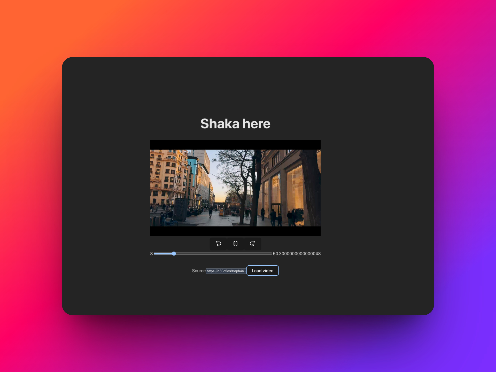

# Video Handles

A modern, extensible video player built with React and TypeScript. This project provides a robust video playback solution with support for multiple video sources and adaptive streaming formats.

Give it a try with: https://d30c5os9orpb46.cloudfront.net/hls/video-handles/stream.m3u8

## Features

- 📺 Multiple video player implementations (HTML5, Shaka Player)
- ⚡ Built with React 19 and TypeScript for type safety
- 🎛️ Customizable player controls and timeline

## Tech Stack

- [React](https://reactjs.org/) - UI library
- [TypeScript](https://www.typescriptlang.org/) - Type checking
- [Vite](https://vitejs.dev/) - Build tool
- [Shaka Player](https://shaka-player-demo.appspot.com/) - For adaptive streaming
- [React Router](https://reactrouter.com/) - For navigation


## Project Structure

```
src/
├── components/         # Reusable UI components
├── features/
│   └── video/         # Video player feature
│       ├── components/  # Video player components
│       └── hooks/       # Custom hooks for video functionality
├── hooks/              # Shared custom hooks
├── pages/              # Page components
├── routes/             # Application routes
├── styles/             # Global styles
└── utils/              # Utility functions
```

